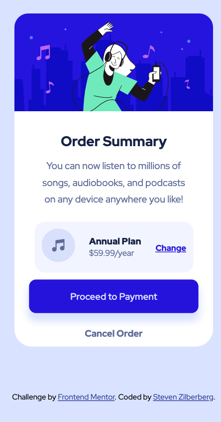

# Frontend Mentor - Order summary card solution

This is a solution to the [Order summary card challenge on Frontend Mentor](https://www.frontendmentor.io/challenges/order-summary-component-QlPmajDUj). Frontend Mentor challenges help you improve your coding skills by building realistic projects. 

## Table of contents

- [Frontend Mentor - Order summary card solution](#frontend-mentor---order-summary-card-solution)
  - [Table of contents](#table-of-contents)
  - [Overview](#overview)
    - [The challenge](#the-challenge)
    - [Screenshot](#screenshot)
    - [Links](#links)
  - [My process](#my-process)
    - [Built with](#built-with)
    - [What I learned](#what-i-learned)
    - [Continued development](#continued-development)
  - [Author](#author)

## Overview

### The challenge

Users should be able to:

- See hover states for interactive elements

### Screenshot

### Links

- Solution URL: [GitHub](https://github.com/srz2/FM-order-summary-component)
- Live Site URL: [Netlify](https://compassionate-beaver-590707.netlify.app/)

## My process

### Built with

- Semantic HTML5 markup
- CSS custom properties
- Flexbox
- Mobile-first workflow

### What I learned

This was very similar in both approach and design concepts as my [first piece]() but it really helped solidify the concepts well enough. I was able to re-enforce the flexgrid within the "plan item" area. I do think this was easier than the first task I did because this does not scale, the desktop version is the same as the mobile version. With the exception of background image which honestly is very easy to overlook.

### Continued development

This was fun just like the other project, but I am looking forward to trying something a little tougher so I can grow a little.

## Author

- GitHub - [@srz2](https://github.com/srz2)
- Frontend Mentor - [@srz2](https://www.frontendmentor.io/profile/srz2)
